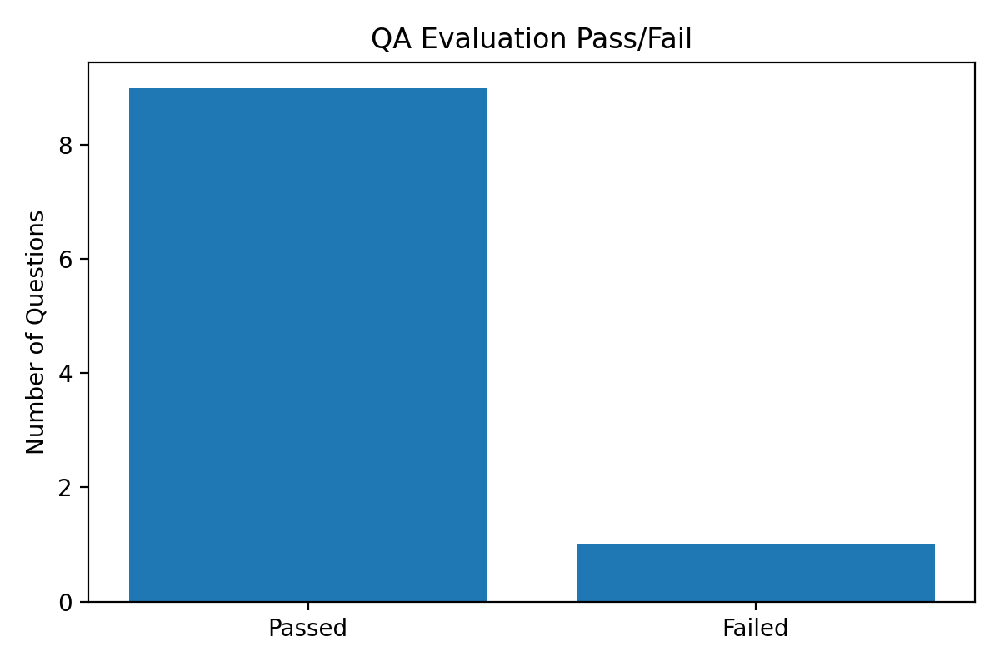
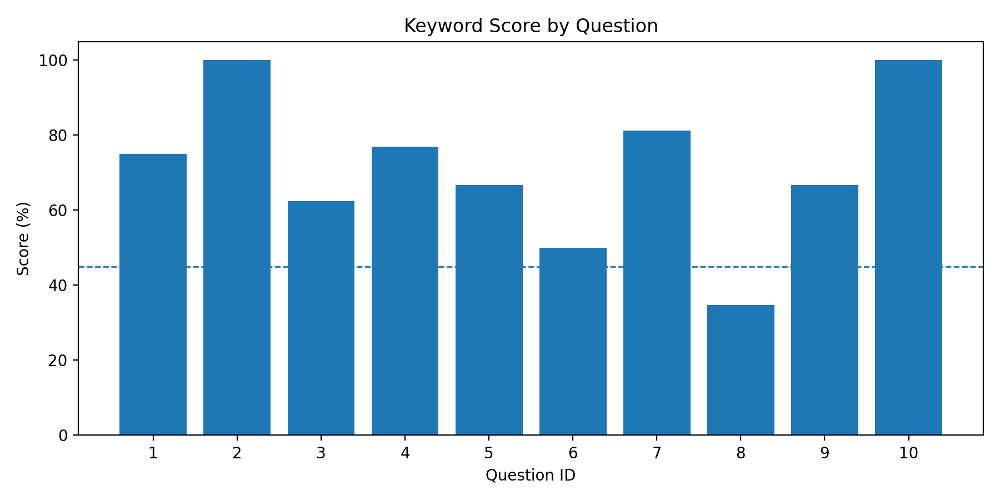
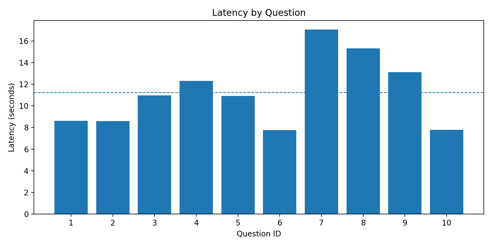
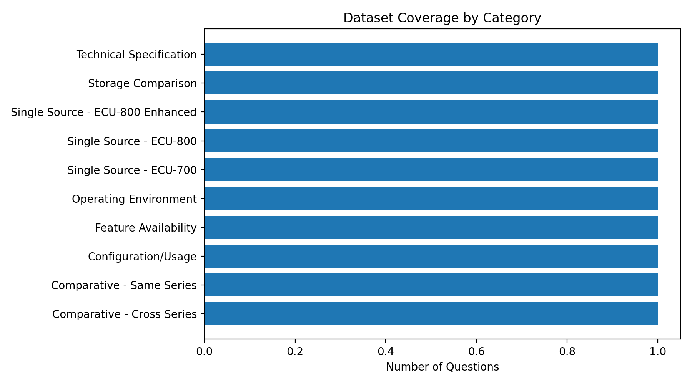
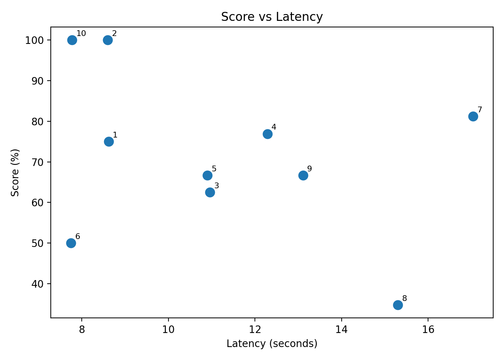

# QA Evaluation Visual Summary

## Key Metrics

- Total questions: 10
- Passed: 9
- Failed: 1
- Pass rate: 90%
- Average keyword score: 71.38%
- Average latency: 11.23s
- Review-required questions: 2

## Most Important Findings

- Overall result is strong: 9 of 10 questions passed.
- The only failed item is Q8, Storage Comparison, with a 34.78% score and `needs_review=True`.
- Q7 passed by keyword score, but confidence is only 0.45 and `needs_review=True`, so it should still be manually checked.
- Highest-scoring questions are Q2 and Q10, both at 100%.
- Slowest question is Q7 at 17.04s, followed by Q8 at 15.30s.

## Charts

